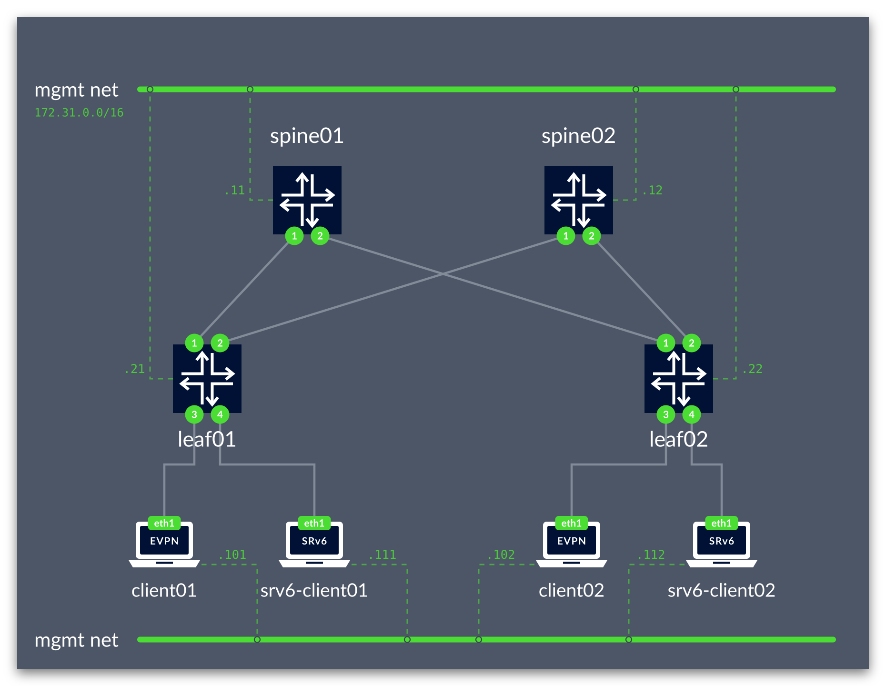
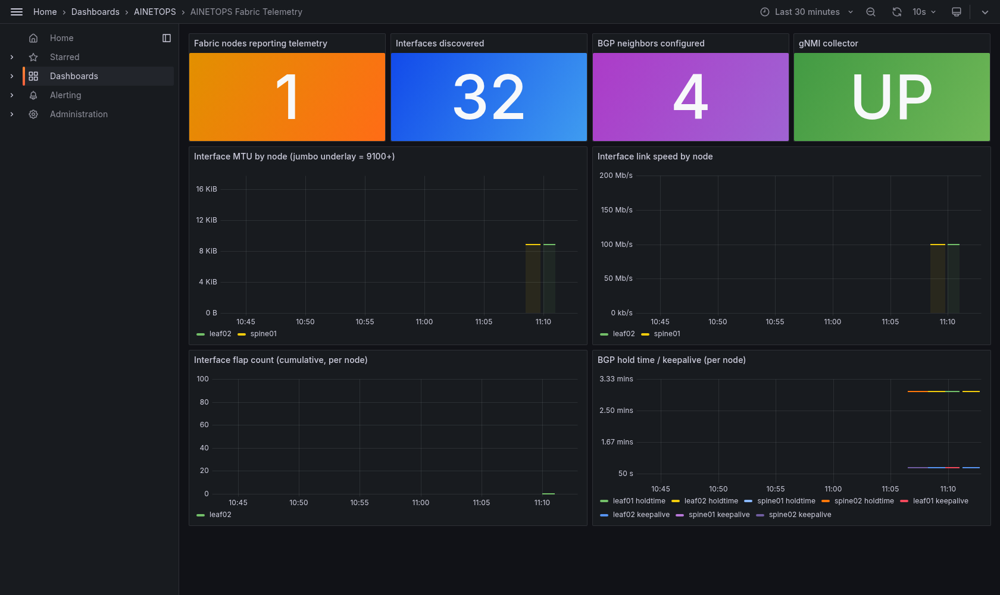
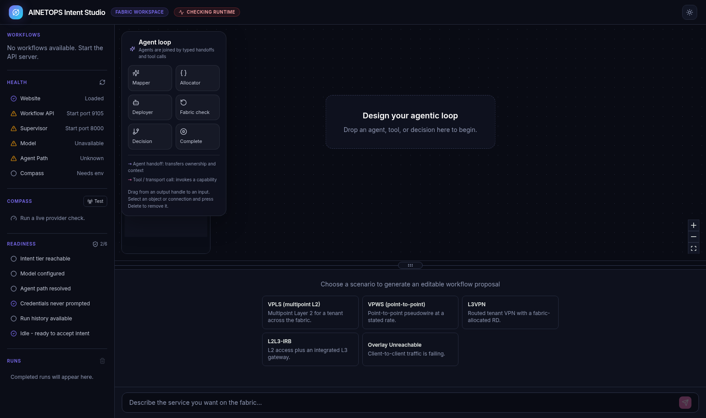

# agentic-netops - Autonomous intent-to-fabric operations.

[](https://github.com/mairp/agentic-netops/actions/workflows/ci.yaml)
[](versions.lock.yaml)
[](versions.lock.yaml)
[](versions.lock.yaml)
[](lab/topology.clab.yml)
[](TUTORIAL.md)

[](agents/README.md)
[](agents/supervisors/provisioning)
[](agents/README.md)
[](deploy/agents/slim.yaml)
[](deploy/gnmi/gnmic.yaml)
[](deploy/observability/prometheus.yaml)
[](deploy/observability/dashboards)

Autonomous intent-to-fabric operations. You state intent in plain language; a multi-agent tier
decomposes it, allocates identifiers and submits declarative resources; Kubernetes
controllers reconcile them onto a live SONiC EVPN/VXLAN fabric and *keep* them that
way -- repairing drift, surviving component failure, and releasing what it claimed
when intent is withdrawn.

The agent tier is not an add-on. It is how the network is driven: the fabric, the
controllers and the agents are three parts of one closed loop, with gNMI telemetry
feeding back into it.

Everything below is self-contained: the instructions live here rather than in
a separate specification.

## Walkthrough


*35s walkthrough — [MP4](docs/images/agentic-netops-demo.mp4). Every frame is real: the
topology is rendered from the running lab, the dashboard shows live gNMI telemetry,
and the pod/series counts are captured values, not mock-ups.*

## The lab



Two spines, two leaves and four clients in containerlab, wired as a Clos with a
dual-stack eBGP underlay and an EVPN/VXLAN overlay.



Live gNMI telemetry from the fabric: gnmic subscribes to each SONiC node's DBs,
Prometheus scrapes gnmic directly, Grafana renders it.



The intent tier's console, wired to the live supervisor: workers reachable over SLIM,
Compass `gpt-5` reached through the LiteLLM gateway. The scenario cards are the
service types the supervisor itself advertises on `GET /suggested-prompts` — VPWS,
VPLS, L3VPN, L2L3-IRB — not a separate hard-coded list.

**What works and what does not:** a prompt reaches the classifier and comes back with
a real, domain-aware answer. A single-shot `POST /agent/prompt/stream` then stops at
the supervisor's own iteration bound, because the graph is built to provision only
"after your two explicit confirmations" and a one-shot request cannot supply them.
The refusal is logged as `audit refuse ... reason=request bound` — the tier declining
to act, not failing.

Live gNMI telemetry: gnmic subscribes to each SONiC node's DBs, Prometheus scrapes
gnmic directly, Grafana renders it.

## What you get

| Piece | What it is |
| --- | --- |
| SONiC fabric | 2 spines, 2 leaves, 4 clients in containerlab; BGP underlay, EVPN/VXLAN overlay |
| Controllers | SRv6Service CRD + provider, built from vendored Go source |
| Observability | OpenTelemetry collector, Prometheus, Grafana with fabric dashboards |
| Intent tier | AGNTCY supervisor + mapper/allocator/deployer agents, chat UI |

## Prerequisites

Read **[docs/DEPENDENCIES.md](docs/DEPENDENCIES.md)** first — it lists the host tooling and two
traps that will otherwise cost you time:

- `provision.sh` dry-runs against your **current kubectl context**. Point it somewhere harmless
  or delete stale clusters first, or you get a confusing `namespaces "kubenet-system" not found`.
- `kubectl top` needs **metrics-server**, which kind does not install. Anything that measures
  resource usage silently returns nothing without it.

## Quickstart

For a guided walk-through — including driving the agents from plain language — see
**[TUTORIAL.md](TUTORIAL.md)**.

```bash
# bring the fabric up (~30-40 min on first run: image pulls + controller build)
./scripts/provision.sh --profile sonic-vs --cluster-name agentic-netops

# verify
./tests/integration/fabric_verify.sh      # BGP sessions, EVPN routes, overlay data path
make verify-pins                          # every image/binary matches versions.lock.yaml
kubectl --context kind-agentic-netops get pods -A

# tear down (idempotent; safe to re-run)
./scripts/off.sh --delete-kind true
```

Add the agent tier:

```bash
./scripts/provision.sh --profile sonic-vs --cluster-name agentic-netops --with-intent-tier
kubectl --context kind-agentic-netops -n agentic-netops-agents get deploy
# UI on http://localhost:30000
```

## Known limitations — read before trusting a run

These are real, reproduced, and documented rather than hidden:

- **EVPN Type-5 routes are not originated.** The pinned `sonic-vs` FRR 10.5.4 build silently drops
  the `vni` line and never adopts the L3VNI. Type-2 and Type-3 work, including the bridged data
  path. See `docs/FABRIC_BGP_EVPN_DEFERRED.md` (D-A2).
- **`vlanmgrd` can crash on startup** (AddressSanitizer), leaving a leaf with no overlay devices,
  so the fabric cannot forward. Provisioning fails closed by design. To continue past it and have
  the defect reported rather than block the run:
  `AGENTIC_NETOPS_WAIVE_L2VNI_ADOPTION=1 ./scripts/provision.sh …` — see D-A3.
- **Two pinned images have no local build step** (`grafana/flow-plugin`,
  `ghcr.io/agentic-netops/topology-generator`). Provisioning warns rather than fails; the dependent
  workload ends in `ImagePullBackOff`. `deployment/ui` is the observed case.
- **`docs/INTENT_TIER_OPS_READINESS.md` contains resource figures that were never measured.**
  They were produced before a cluster existed and before metrics-server was installed; real
  values differ by large factors. Re-measure before relying on that document.

## Repository layout

```
scripts/          provision.sh, off.sh, and lib/ (containerlab, rbac, qualify, intent_tier)
lab/              containerlab topology and the sonic-vs profile bootstrap
deploy/           Kubernetes manifests: controllers, kubenet, observability, agents
controllers/      SRv6Service controller (Go)
tests/            integration (fabric_verify, cycles_runner) and unit suites
agents/           intent tier: supervisors, provisioning workers, test corpora (002 branch)
docs/             operations, security audit, dependencies, known defects
versions.lock.yaml  every image and binary pin; enforced by `make verify-pins`
```

## Policies enforced in CI

**Jumbo MTU** — the lab standardises on underlay MTU 9216. VXLAN effective payload is 9166 (IPv4)
and 9162 (IPv6); with 3 SRv6 SIDs it is ~9120. Acceptance tests size packets to avoid
fragmentation.

**Supply chain** — `make verify-pins` fails if any running image or binary drifts from
`versions.lock.yaml`.
