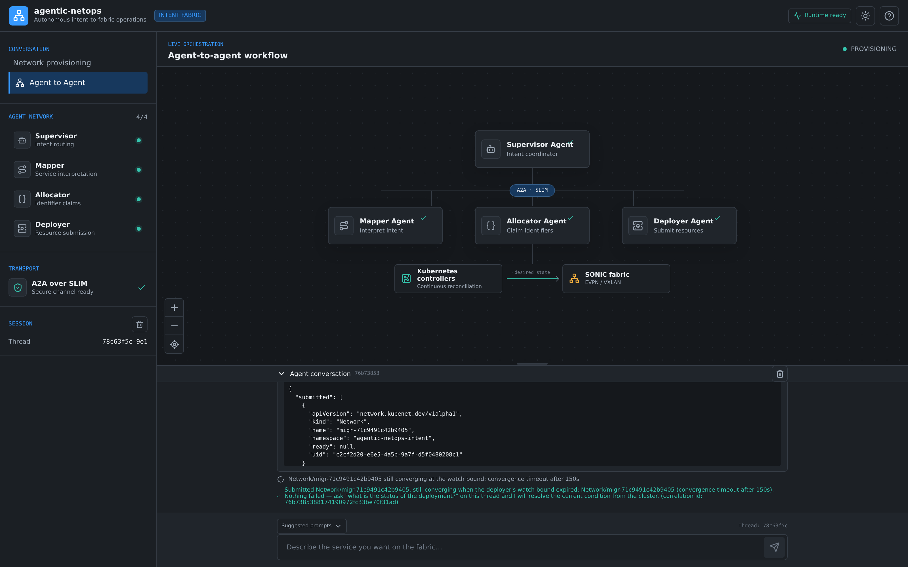

# agentic-netops - Autonomous intent-to-fabric operations.

[](https://github.com/mairp/agentic-netops/actions/workflows/ci.yaml)
[](versions.lock.yaml)
[](versions.lock.yaml)
[](versions.lock.yaml)
[](lab/topology.clab.yml)
[](TUTORIAL.md)

[](agents/README.md)
[](agents/supervisors/provisioning)
[](agents/README.md)
[](deploy/agents/slim.yaml)
[](deploy/gnmi/gnmic.yaml)
[](deploy/observability/prometheus.yaml)
[](deploy/observability/dashboards)

Autonomous intent-to-fabric operations. You state intent in plain language; a multi-agent tier
decomposes it, allocates identifiers and submits declarative resources; Kubernetes
controllers reconcile them onto a live SONiC EVPN/VXLAN fabric and *keep* them that
way -- repairing drift, surviving component failure, and releasing what it claimed
when intent is withdrawn.

The agent tier is not an add-on. It is how the network is driven: the fabric, the
controllers and the agents are three parts of one closed loop, with gNMI telemetry
feeding back into it.

Everything below is self-contained: the instructions live here rather than in
a separate specification.

## The lab


Two spines, two leaves and four clients in containerlab, wired as a Clos with a
dual-stack eBGP underlay and an EVPN/VXLAN overlay.


Live gNMI telemetry from the fabric: gnmic subscribes to each SONiC node's DBs,
Prometheus scrapes gnmic directly, Grafana renders it.


The intent tier's console during a real run, wired to the live supervisor:
workers reachable over SLIM, Compass `gpt-5` reached through the LiteLLM
gateway, and the mapper's own interpretation of the request shown before
anything is allocated. The scenario cards are the constructs the supervisor
itself advertises on `GET /suggested-prompts` — vlan, mac-vrf, ip-vrf, acl —
not a separate hard-coded list, and every card names ports this site actually
has. The divider between the workflow canvas and the conversation is draggable
(mouse, touch, or arrow keys); the chosen split is remembered per browser.



The end of the same transaction. The `submitted` payload is authoritative and
exists only because every apply succeeded; when convergence is still in flight
at the deployer's watch bound the console says exactly that, names the resource,
and points at the status tool — it does not report a success it has not
observed.

**What works and what does not:** in the console, a provisionable request flows
end to end — classification, interpretation, allocation, your two explicit
confirmations, then a real deployment transaction against the cluster (translate
pod-local, server-side dry-run, deterministic apply, rollback on failure,
convergence watch) and a truthful `submitted` report — **and the southbound
closes the loop**: a `sonicprovider` Network controller renders the accepted
Network onto the SONiC fabric through the host-side fabric-executor and flips
the Network's `Ready` condition to True only after per-node verification
passes. **All four constructs converge.** Each of vlan, mac-vrf, ip-vrf and acl
has been driven from plain language to `Ready=True` on this lab (2026-09-05),
with the VRF/VXLAN/SVI/vtep/access state and the EVPN control plane asserted on
both leaves as applicable. Until 2026-09-04 only the routed construct could ever
converge: L2 services failed at the fabric *after* the objects were on the
cluster and after the
deployer had reported a successful submission. What was broken in each, and what
is still limited (IPv6 IRB gateways), is recorded in
[docs/INTENT_TIER_SERVICE_TYPES.md](docs/INTENT_TIER_SERVICE_TYPES.md).

An endpoint naming a node or port the site does not have is refused by the
translator **before** anything is submitted, with the site's real names listed,
instead of stranding an unrenderable Network on the cluster. And a converged
service is re-applied and re-verified every five minutes, so `Ready=True` is a
statement about the fabric now rather than about the moment it first converged:
drift — a device manager that died, a reboot, another service's teardown taking
a shared device with it — is repaired, and said so. A single-shot
`POST /agent/prompt/stream`, however, stops at the supervisor's own iteration
bound, because the graph is built to provision only "after your two explicit
confirmations" and a one-shot request cannot supply them. The refusal is logged
as `audit refuse ... reason=request bound` — the tier declining
to act, not failing. The transaction contract, including what counts as a
reportable failure at each phase, is specified in
[docs/INTENT_TIER_DEPLOYMENT_TRANSACTION.md](docs/INTENT_TIER_DEPLOYMENT_TRANSACTION.md).

Live gNMI telemetry: gnmic subscribes to each SONiC node's DBs, Prometheus scrapes
gnmic directly, Grafana renders it.

## What you get

| Piece | What it is |
| --- | --- |
| SONiC fabric | 2 spines, 2 leaves, 4 clients in containerlab; BGP underlay, EVPN/VXLAN overlay |
| Controllers | SRv6Service CRD + provider, built from vendored Go source |
| Observability | OpenTelemetry collector, Prometheus, Grafana with fabric dashboards |
| Intent tier | AGNTCY supervisor + mapper/allocator/deployer agents over A2A/SLIM; the deployer runs the deployment transaction (translate → dry-run → apply → rollback → convergence watch) and reports truthfully |

## Prerequisites

Read **[docs/DEPENDENCIES.md](docs/DEPENDENCIES.md)** first — it lists the host tooling and two
traps that will otherwise cost you time:

- `provision.sh` dry-runs against your **current kubectl context**. Point it somewhere harmless
  or delete stale clusters first, or you get a confusing `namespaces "kubenet-system" not found`.
- `kubectl top` needs **metrics-server**, which kind does not install. Anything that measures
  resource usage silently returns nothing without it.

## Quickstart

For a guided walk-through — including driving the agents from plain language — see
**[TUTORIAL.md](TUTORIAL.md)**.

```bash
# bring the fabric up (~30-40 min on first run: image pulls + controller build)
./scripts/provision.sh --profile sonic-vs --cluster-name agentic-netops

# verify
./tests/integration/fabric_verify.sh      # BGP sessions, EVPN routes, overlay data path
make verify-pins                          # every image/binary matches versions.lock.yaml
kubectl --context kind-agentic-netops get pods -A

# tear down (idempotent; safe to re-run)
./scripts/off.sh --delete-kind true
```

Add the agent tier:

```bash
# LLM provider credentials — export these before provisioning.
# AGENTIC_NETOPS_LLM_BASE_URL is optional but matters: without it LiteLLM's
# `openai` provider defaults to https://api.openai.com/v1, which rejects
# gateway keys (e.g. Compass/Core42). Re-running provisioning without the
# base URL preserves whatever the existing Secret carries.
export AGENTIC_NETOPS_LLM_MODEL=openai/gpt-5
export AGENTIC_NETOPS_LLM_API_KEY=<your key>            # never committed
export AGENTIC_NETOPS_LLM_BASE_URL=https://api.core42.ai/v1

./scripts/provision.sh --profile sonic-vs --cluster-name agentic-netops --with-intent-tier
kubectl --context kind-agentic-netops -n agentic-netops-agents get deploy
# UI on http://localhost:30000
```

## Known limitations — read before trusting a run

These are real, reproduced, and documented rather than hidden:

- The former SONiC ASan/L2-VNI and EVPN Type-5 limitations (D-A2/D-A3) were
  resolved on 2026-09-04 by the clean `sonic-vs-gnmi:202505-v1` image. The
  unwaived fabric gate now verifies Type-2/3/5, remote VTEPs, and overlay traffic.
- **Two pinned images have no local build step** (`grafana/flow-plugin`,
  `ghcr.io/agentic-netops/topology-generator`). Provisioning warns rather than fails; the dependent
  workload ends in `ImagePullBackOff`. (The intent tier's six images — supervisor, mapper,
  allocator, deployer, translator, UI — all build locally from `docker/Dockerfile.*`; note
  `intent::install` skips the docker build when the image tag already exists locally unless
  `INTENT_TIER_REBUILD=true`, so source changes need a rebuild or a forced rebuild to reach the
  cluster.)
- **IPv6 IRB gateways may not originate their Type-5 route.** An IRB carries only
  the address families the operator asked for; when IPv6 *is* requested, this
  sonic-vs FRR build sometimes registers the global address as a kernel rather
  than a connected route, and `redistribute connected` then never originates it.
  The service reports `Ready=False` naming the missing route rather than claiming
  success. See [docs/INTENT_TIER_SERVICE_TYPES.md](docs/INTENT_TIER_SERVICE_TYPES.md).
- **`docs/INTENT_TIER_OPS_READINESS.md` contains resource figures that were never measured.**
  They were produced before a cluster existed and before metrics-server was installed; real
  values differ by large factors. Re-measure before relying on that document.

## Repository layout

```
scripts/          provision.sh, off.sh, and lib/ (containerlab, rbac, qualify, intent_tier)
lab/              containerlab topology and the sonic-vs profile bootstrap
deploy/           Kubernetes manifests: controllers, kubenet, observability, agents
controllers/      SRv6Service and sonicprovider Network controllers (Go); see README-CONTROLLERS.md
tests/            integration (fabric_verify, cycles_runner) and unit suites
agents/           intent tier: supervisors, provisioning workers, test corpora
docs/             operations, security audit, dependencies, known defects
versions.lock.yaml  every image and binary pin; enforced by `make verify-pins`
```

## Policies enforced in CI

**Jumbo MTU** — the lab standardises on underlay MTU 9216. VXLAN effective payload is 9166 (IPv4)
and 9162 (IPv6); with 3 SRv6 SIDs it is ~9120. Acceptance tests size packets to avoid
fragmentation.

**Supply chain** — `make verify-pins` fails if any running image or binary drifts from
`versions.lock.yaml`.
